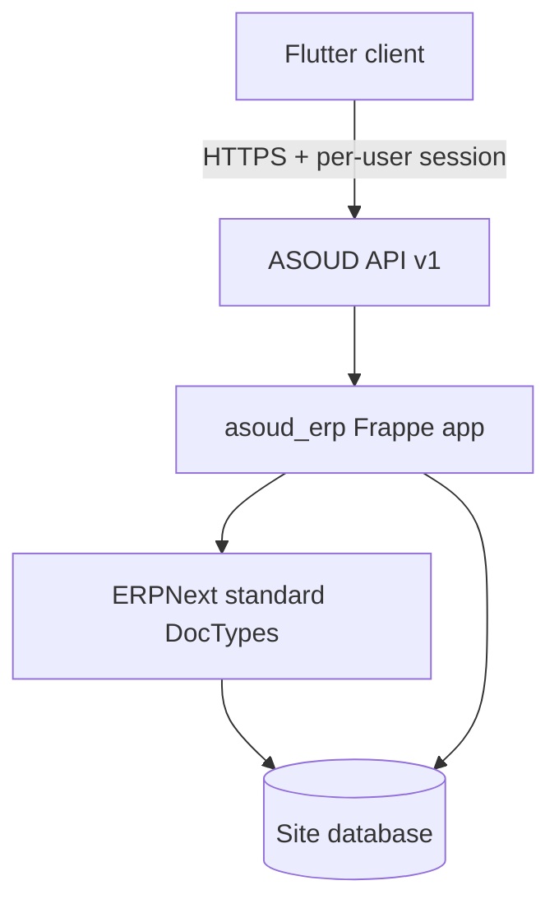

# معماری سامانه



## قواعد مرزی

1. Flutter مسئول UI، وضعیت صفحه و تبدیل DTO است؛ منطق حسابداری و مجوز در سرور می‌ماند.
2. افزونه `asoud_erp` تنها محل کد اختصاصی ASOUD است.
3. `frappe-erp-next-1` باید tree رسمی upstream را بدون patch اختصاصی نگه دارد.
4. CRUD ساده می‌تواند از REST استاندارد Frappe استفاده کند؛ عملیات ترکیبی و حساس از API نسخه‌دار ASOUD عبور می‌کنند.
5. مجوز UI صرفاً برای تجربه کاربری است؛ مرجع امنیت Frappe است.

## جریان عمودی فعلی

```text
Login → Company selection → load account tree → create account
      → server allocates final code → refresh account tree
```

این جریان باید روی سایت آزمایشی Frappe/ERPNext تست شود؛ تست واحد جایگزین تست نصب و مجوز نیست.
