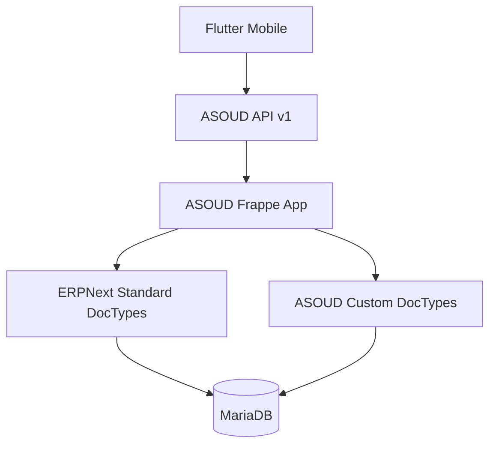

# معماری سیستم

## نمای کلی

## لایه Flutter

- Presentation: صفحات و Widgetها
- State: BLoC/Cubit
- Domain: Entity، Use Case و Repository Contract
- Data: Model، Data Source و Repository Implementation
- Core: شبکه، پیکربندی، خطاها و Design System

## لایه Backend

- `api/v1`: نقاط ورود نسخه‌بندی‌شده موبایل
- `services`: قواعد کسب‌وکار و تراکنش‌ها
- `doctype`: مدل‌های اختصاصی ASOUD
- ERPNext DocTypes: Company، Account، Journal Entry و سایر مدل‌های استاندارد

تنظیمات راه‌اندازی وابسته به شرکت در DocType مستقل `ASOUD Company Setup` ذخیره می‌شود. این مدل با
Link یکتای Company، مراحل ذخیره دفتر، تنظیمات حسابداری و نقش‌های فعال دفتر را نگه می‌دارد. تنظیمات
سراسری تولید کد در `ASOUD Settings` باقی می‌مانند و داده‌های company-scoped وارد Singleton نمی‌شوند.

پروفایل `ASOUD Party Profile` هویت واحد شخص را نگه می‌دارد. نقش‌های مشتری و
تأمین‌کننده به DocTypeهای استاندارد ERPNext متصل می‌شوند و تفصیلی‌های مرتبط
بدون تکثیر هویت شخص تولید می‌شوند.

سند اولیه در `ASOUD Accounting Voucher` نگهداری می‌شود تا گردش تأیید از ثبت
قطعی جدا بماند. تنها پس از تأیید مدیر حسابداری، یک `Journal Entry` استاندارد و
Submit‌شده در ERPNext ایجاد و شناسه آن روی سند ASOUD ثبت می‌شود.

گزارش‌های مالی از `GL Entry` رسمی ERPNext خوانده می‌شوند تا اسناد تولیدشده توسط
خرید، فروش، انبار و سایر ماژول‌ها نیز بدون کپی داده در تراز و دفاتر دیده شوند.
Backend مسئول محاسبه افتتاحیه و مانده تجمعی است و Flutter فقط نمایش و فیلتر را
انجام می‌دهد.

## قانون وابستگی

Flutter نباید مستقیماً به جزئیات داخلی DocTypeهای سفارشی وابسته شود. پاسخ API باید پایدار و نسخه‌بندی‌شده باشد.
