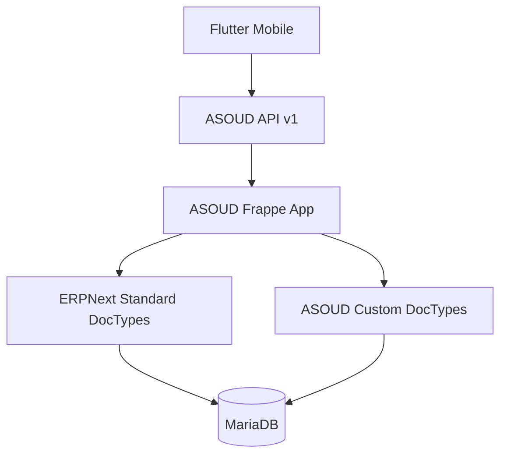

# معماری سیستم

## نمای کلی

## لایه Flutter

- Presentation: صفحات و Widgetها
- State: BLoC/Cubit
- Domain: Entity، Use Case و Repository Contract
- Data: Model، Data Source و Repository Implementation
- Core: شبکه، پیکربندی، خطاها و Design System

## لایه Backend

- `api/v1`: نقاط ورود نسخه‌بندی‌شده موبایل
- `services`: قواعد کسب‌وکار و تراکنش‌ها
- `doctype`: مدل‌های اختصاصی ASOUD
- ERPNext DocTypes: Company، Account، Journal Entry و سایر مدل‌های استاندارد

## قانون وابستگی

Flutter نباید مستقیماً به جزئیات داخلی DocTypeهای سفارشی وابسته شود. پاسخ API باید پایدار و نسخه‌بندی‌شده باشد.

